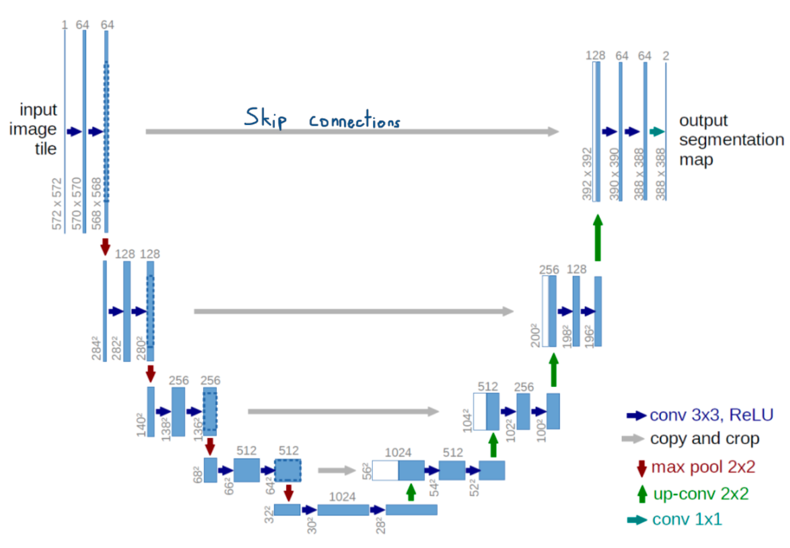
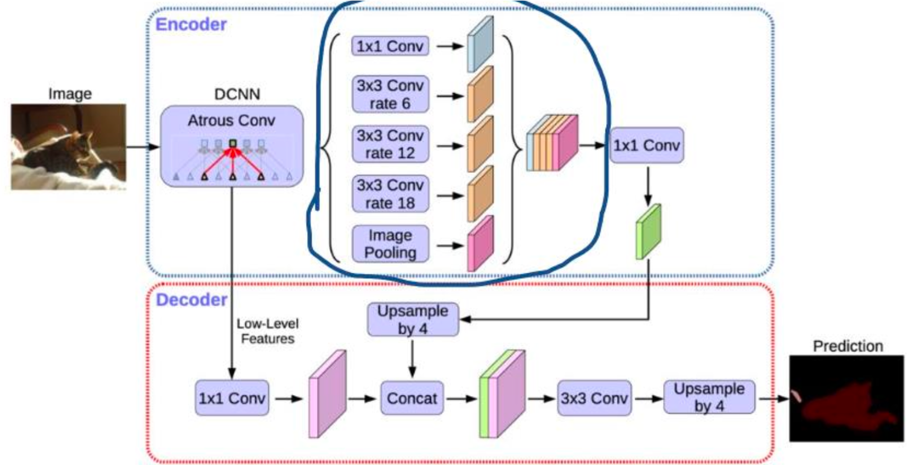
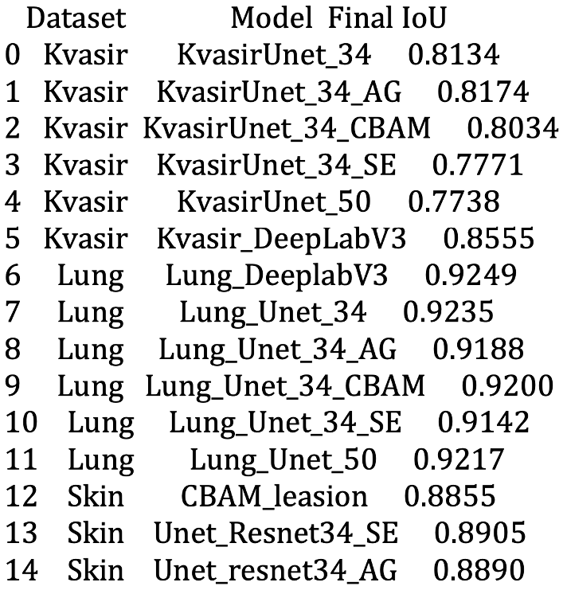
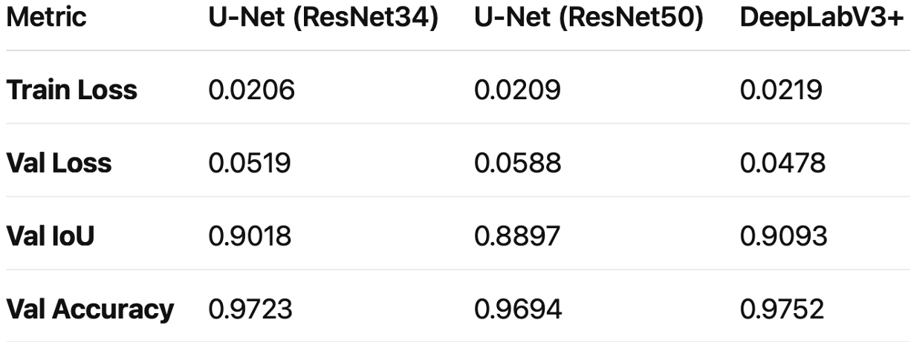
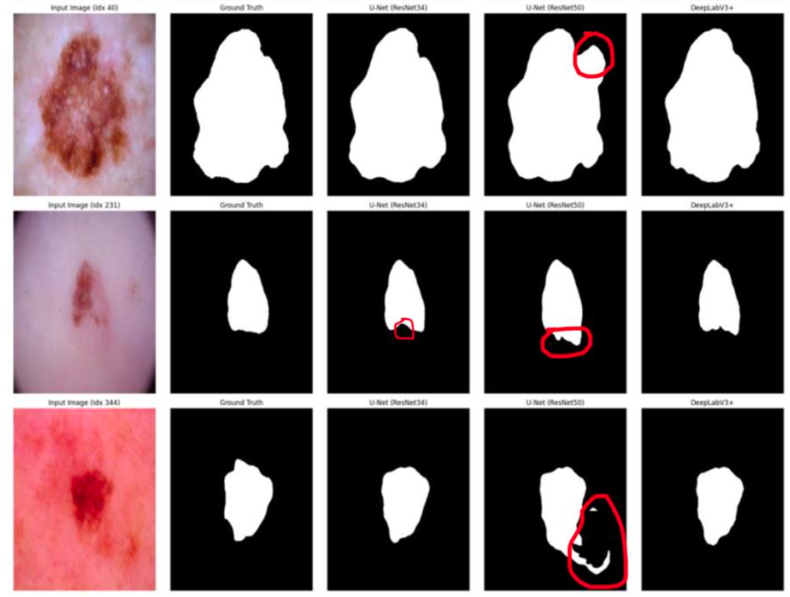

# Medical Image Segmentation

**Martin Osmani** — Final Year Project, Royal Holloway University of London
Supervisor: Li Zhang

Comparative study of deep learning segmentation architectures across three medical imaging datasets. Six model configurations were trained and evaluated on each dataset, covering standard U-Net baselines, attention-enhanced variants, and DeepLabV3+.

Medical image segmentation is a critical task in healthcare, aiding diagnosis by precisely identifying regions of interest. This project evaluates state-of-the-art deep learning models across different datasets and experiments with different encoders and attention mechanisms, motivated by the growing importance of AI-driven solutions in clinical workflows.

---

## Datasets

| Dataset | Task | Images |
|---|---|---|
| [HAM10000](https://www.kaggle.com/datasets/kmader/skin-cancer-mnist-ham10000) | Skin lesion segmentation | 10,015 dermoscopic images |
| [Montgomery & Shenzhen](https://www.kaggle.com/datasets/nikhilpandey360/chest-xray-masks-and-labels) | Lung X-ray segmentation | ~800 chest X-rays |
| [Kvasir-SEG](https://datasets.simula.no/kvasir-seg/) | Polyp segmentation | 1,000 endoscopic images |

---

## Models

Six architectures were compared on each dataset:

| Model | Encoder | Notes |
|---|---|---|
| U-Net | ResNet34 | Baseline |
| U-Net | ResNet50 | Deeper baseline |
| U-Net + Attention Gate (AG) | ResNet34 | Soft attention on skip connections |
| U-Net + Squeeze-and-Excitation (SE) | ResNet34 | Channel-wise recalibration |
| U-Net + CBAM | ResNet34 | Channel + spatial attention |
| DeepLabV3+ | EfficientNet-B3 (skin) / ResNet (lung, polyp) | Atrous convolutions with ASPP |

All models trained with Dice loss, AdamW optimiser, and evaluated using IoU (Jaccard Index).

### U-Net Architecture



*Source: Ronneberger et al., "U-Net: Convolutional Networks for Biomedical Image Segmentation", Freiburg University. Available: https://lmb.informatik.uni-freiburg.de/people/ronneber/u-net/*

### DeepLabV3+ Architecture



*Source: Alejandro Ito Aramendia, "Decoding the U-Net: A Complete Guide". Available: https://medium.com/@alejandro.itoaramendia/decoding-the-u-net-a-complete-guide-810b1c6d56d8*

---

## Results

### Final IoU Scores (All Datasets)



### Skin Lesion (HAM10000)

| Model | Val IoU |
|---|---|
| DeepLabV3+ | **0.9093** |
| U-Net ResNet34 | 0.9017 |
| U-Net ResNet34 + SE | 0.8905 |
| U-Net ResNet50 | 0.8897 |
| U-Net ResNet34 + AG | 0.8890 |
| U-Net ResNet34 + CBAM | 0.8855 |

**Skin lesion metric comparison (U-Net ResNet34 vs ResNet50 vs DeepLabV3+):**



**Segmentation output comparison:**



*Red circles highlight where U-Net ResNet50 incorrectly segments regions not present in the ground truth mask.*

### Lung X-Ray

| Model | Val IoU |
|---|---|
| DeepLabV3+ | **0.9249** |
| U-Net ResNet34 | 0.9235 |
| U-Net ResNet50 | 0.9217 |
| U-Net ResNet34 + CBAM | 0.9200 |
| U-Net ResNet34 + AG | 0.9188 |
| U-Net ResNet34 + SE | 0.9142 |

### Kvasir-SEG (Polyp)

| Model | Val IoU |
|---|---|
| DeepLabV3+ | **0.8555** |
| U-Net ResNet34 + AG | 0.8174 |
| U-Net ResNet34 | 0.8134 |
| U-Net ResNet34 + CBAM | 0.8034 |
| U-Net ResNet34 + SE | 0.7771 |
| U-Net ResNet50 | 0.7738 |

---

## Conclusions

- **DeepLabV3+ consistently outperformed all U-Net variants** across all three datasets, though differences were small (within ~1% IoU on lung and skin).
- **Polyp segmentation was the hardest task** — DeepLabV3+ led by ~4% IoU, suggesting multi-scale atrous convolutions better handle the irregular, low-contrast nature of polyp boundaries.
- **Attention mechanisms produced mixed results.** Attention Gate showed marginal improvements on the polyp dataset, but on skin lesions, adding attention to U-Net did not consistently improve accuracy.
- **ResNet50 underperformed ResNet34** despite its greater depth. The deeper encoder captured more fine-grained features, including regions absent from the ground truth masks — highlighting that model complexity does not always translate to better segmentation performance.
- **Mask quality is a confounding factor.** The hand-drawn nature of ground truth masks introduces inconsistency that limits how much metric differences between models can be attributed to architecture alone.

---

## Repository Structure

```
├── model-eval.ipynb                          # Cross-dataset comparison and visualisations
├── images/                                   # Architecture diagrams and result figures
├── skin-lesion-segmentation/
│   ├── skin-lesion-unet-resnet34.ipynb
│   ├── skin-lesion-unet-resnet50.ipynb
│   ├── skin-lesion-unet-resnet34-ag.ipynb
│   ├── skin-lesion-unet-resnet34-se.ipynb
│   ├── skin-lesion-unet-resnet34-cbam.ipynb
│   └── skin-lesion-deeplabv3plus.ipynb
├── lung-xray-segmentation/
│   ├── lung-xray-unet-resnet34.ipynb
│   ├── lung-xray-unet-resnet50.ipynb
│   ├── lung-xray-unet-resnet34-ag.ipynb
│   ├── lung-xray-unet-resnet34-se.ipynb
│   ├── lung-xray-unet-resnet34-cbam.ipynb
│   └── lung-xray-deeplabv3plus.ipynb
└── kvasir-polyp-segmentation/
    ├── kvasir-unet-resnet34.ipynb
    ├── kvasir-unet-resnet50.ipynb
    ├── kvasir-unet-resnet34-ag.ipynb
    ├── kvasir-unet-resnet34-se.ipynb
    ├── kvasir-unet-resnet34-cbam.ipynb
    └── kvasir-deeplabv3plus.ipynb
```

---

## Dependencies

```
torch
torchvision
segmentation-models-pytorch
albumentations
torchmetrics
pandas
matplotlib
scikit-learn
Pillow
```

Notebooks were trained on Kaggle and Google Colab using GPU (CUDA). To reproduce, upload the respective dataset to your environment and update the dataset path variables in each notebook.

---

## References

1. Tschandl, P., Rosendahl, C. & Kittler, H. The HAM10000 dataset, a large collection of multi-source dermatoscopic images of common pigmented skin lesions. *Sci Data* 5, 180161 (2018).
2. Jha, D., et al. Kvasir-SEG: A Segmented Polyp Dataset. *MediaEval* (2019). Available: https://datasets.simula.no/kvasir-seg/
3. Pandey, N. Lung Segmentation from Chest X-Ray Dataset. Available: https://www.kaggle.com/datasets/nikhilpandey360/chest-xray-masks-and-labels
4. Ronneberger, O., Fischer, P., & Brox, T. U-Net: Convolutional Networks for Biomedical Image Segmentation. *MICCAI* (2015). Available: https://lmb.informatik.uni-freiburg.de/people/ronneber/u-net/
5. Chen, L.C., et al. Encoder-Decoder with Atrous Separable Convolution for Semantic Image Segmentation (DeepLabV3+). *ECCV* (2018).
